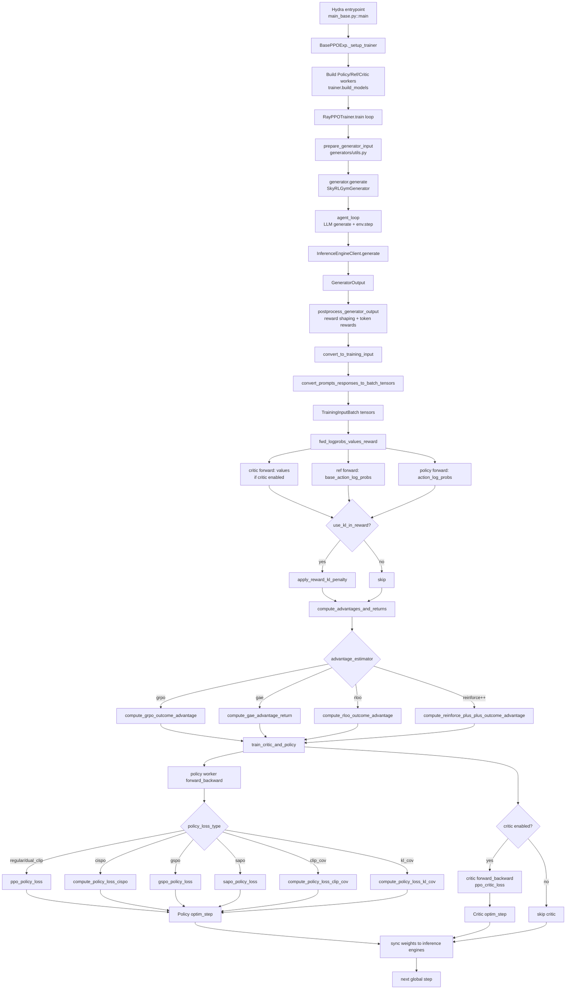

# Algorithms Implemented in This Repo (GRPO and Variants)

This document summarizes the algorithms implemented in `skyrl-train`, with focus on GRPO-style training and variants (DAPO, Dr.GRPO, CISPO, GSPO, SAPO), their objectives, and config knobs.

Primary implementation files:
- `skyrl-train/skyrl_train/utils/ppo_utils.py`
- `skyrl-train/skyrl_train/trainer.py`
- `skyrl-train/skyrl_train/config/ppo_base_config.yaml`
- Example run scripts under `skyrl-train/examples/algorithms/`

## 1) Core GRPO Implementation in This Codebase

GRPO here is implemented as:
1. Sample `n_samples_per_prompt` responses per prompt.
2. Convert rewards to token-level (if response-level reward, place it on final token).
3. Compute per-group (same prompt UID) centered outcome advantage:
   - `score_i = sum_t reward_{i,t}`
   - `A_i = (score_i - mean_g) / (std_g + eps)` if `grpo_norm_by_std=true`
   - `A_i = (score_i - mean_g)` if `grpo_norm_by_std=false`
   - Broadcast `A_i` to response tokens with `response_mask`.
4. Compute policy loss via selected `policy_loss_type`.
5. Optionally add KL loss term (`use_kl_loss`) or KL-in-reward (`use_kl_in_reward`) (mutually exclusive).
6. Optionally add entropy bonus (`use_entropy_loss`).

Important GRPO-related defaults:
- `trainer.algorithm.advantage_estimator: "grpo"`
- `trainer.algorithm.policy_loss_type: "regular"`
- `trainer.algorithm.loss_reduction: "token_mean"`
- `trainer.algorithm.grpo_norm_by_std: true`

## 2) Implemented GRPO Variants and Related Algorithms

### 2.1 GRPO (baseline)
- Enable:
  - `trainer.algorithm.advantage_estimator="grpo"`
  - `trainer.algorithm.policy_loss_type="regular"` (or default)
- Objective:
  - PPO clipped policy objective with GRPO group-relative advantage.
  - `ratio = exp(logp_new - logp_old)`
  - `L = -min(ratio*A, clip(ratio, 1-eps_low, 1+eps_high)*A)`
- Main knobs:
  - `trainer.algorithm.grpo_norm_by_std`
  - `trainer.algorithm.eps_clip_low`
  - `trainer.algorithm.eps_clip_high`
  - `trainer.algorithm.loss_reduction`
  - `generator.n_samples_per_prompt` (group size)

### 2.2 DAPO (recipe built on GRPO)
- Example:
  - `skyrl-train/examples/algorithms/dapo/run_dapo_gsm8k.sh`
  - Entry point with custom reward shaping: `skyrl-train/examples/algorithms/dapo/main_dapo.py`
- Enable (core):
  - `advantage_estimator="grpo"`
  - `policy_loss_type="dual_clip"`
  - `eps_clip_low != eps_clip_high` (clip-higher)
  - `dynamic_sampling.type="filter"`
  - `loss_reduction="token_mean"`
- Objective delta vs baseline:
  - Uses dual-clip PPO and DAPO-style dynamic sampling/filtering of zero-variance prompt groups.
  - Optional overlong reward shaping:
    - hard filter: `generator.apply_overlong_filtering=true`
    - soft punishment: custom trainer in `main_dapo.py` with `+trainer.algorithm.overlong_buffer.*`
- Main knobs:
  - `trainer.algorithm.policy_loss_type=dual_clip`
  - `trainer.algorithm.clip_ratio_c`
  - `trainer.algorithm.eps_clip_low`
  - `trainer.algorithm.eps_clip_high`
  - `trainer.algorithm.dynamic_sampling.type`
  - `trainer.algorithm.dynamic_sampling.max_sample_batches`
  - `generator.apply_overlong_filtering`
  - `+trainer.algorithm.overlong_buffer.len`
  - `+trainer.algorithm.overlong_buffer.penalty_factor`
  - Optional off-policy correction in some DAPO scripts: `use_tis`, `tis_imp_ratio_cap`

### 2.3 Dr.GRPO
- Example:
  - `skyrl-train/examples/algorithms/drgrpo/run_drgrpo_gsm8k.sh`
- Enable:
  - `advantage_estimator="grpo"`
  - `grpo_norm_by_std=false`
  - `loss_reduction="seq_mean_token_sum_norm"`
- Objective delta vs baseline:
  - Same GRPO-style grouped advantage, but no std normalization.
  - Sequence loss normalized by fixed max sequence length to reduce length bias.
- Main knobs:
  - `trainer.algorithm.grpo_norm_by_std`
  - `trainer.algorithm.loss_reduction=seq_mean_token_sum_norm`
  - `trainer.algorithm.max_seq_len` (auto-added as prompt max + generate max)

### 2.4 CISPO
- Example:
  - `skyrl-train/examples/algorithms/cispo/run_cispo_gsm8k.sh`
- Enable:
  - `trainer.algorithm.policy_loss_type="cispo"`
- Objective:
  - `ratio = exp(logp_new - logp_old)`
  - `clamped = clip(ratio, 1-cispo_low, 1+cispo_high)`
  - `L = -A * stop_grad(clamped) * logp_new`
  - Key difference from PPO clipping: clipping affects IS weighting in gradient multiplier, not hard zeroing like clipped PPO branch.
- Main knobs:
  - `trainer.algorithm.cispo.cispo_eps_clip_low`
  - `trainer.algorithm.cispo.cispo_eps_clip_high`
  - `trainer.algorithm.loss_reduction`

### 2.5 GSPO
- Example:
  - `skyrl-train/examples/algorithms/gspo/run_gspo_gsm8k.sh`
- Enable:
  - `trainer.algorithm.policy_loss_type="gspo"`
  - `trainer.algorithm.loss_reduction="sequence_mean"` (recommended)
- Objective delta vs baseline:
  - Uses sequence-level importance weights (mean log-ratio per sequence), then applies PPO-style clipping.
  - This changes clipping dynamics vs token-level PPO ratio.
- Main knobs:
  - `trainer.algorithm.eps_clip_low`
  - `trainer.algorithm.eps_clip_high`
  - `trainer.algorithm.loss_reduction=sequence_mean`

### 2.6 SAPO
- Examples:
  - `skyrl-train/examples/algorithms/sapo/run_sapo_gsm8k.sh`
  - `skyrl-train/examples/algorithms/sapo/run_sapo_qwen3_4b_aime.sh`
- Enable:
  - `trainer.algorithm.policy_loss_type="sapo"`
  - `trainer.algorithm.loss_reduction="sequence_mean"` (recommended)
- Objective:
  - `ratio = exp(logp_new - logp_old)`
  - Gate per token: `f(r,tau)=sigmoid(tau*(r-1))*(4/tau)`
  - `tau=tau_pos` for positive advantage, else `tau_neg`
  - `L = -f(ratio,tau)*A`
- Main knobs:
  - `trainer.algorithm.sapo.tau_pos`
  - `trainer.algorithm.sapo.tau_neg`
  - `trainer.algorithm.loss_reduction=sequence_mean`

### 2.7 Clip-Cov (policy-loss variant)
- Example:
  - `skyrl-train/examples/algorithms/clip_cov_kl_cov/run_clip_cov.sh`
- Enable:
  - `trainer.algorithm.policy_loss_type="clip_cov"`
- Objective delta:
  - Starts from PPO-style losses, then applies covariance-based correction mask for subset of tokens.
- Main knobs:
  - `trainer.algorithm.clip_cov.clip_ratio`
  - `trainer.algorithm.clip_cov.clip_cov_lb`
  - `trainer.algorithm.clip_cov.clip_cov_ub`

### 2.8 KL-Cov (policy-loss variant)
- Example:
  - `skyrl-train/examples/algorithms/clip_cov_kl_cov/run_kl_cov.sh`
- Enable:
  - `trainer.algorithm.policy_loss_type="kl_cov"`
- Objective delta:
  - Applies KL regularization to covariance-selected subset of valid tokens.
- Main knobs:
  - `trainer.algorithm.kl_cov.kl_cov_frac`
  - `trainer.algorithm.kl_cov.ppo_kl_coef`

### 2.9 RLOO (advantage variant)
- Example:
  - `skyrl-train/examples/algorithms/rloo/run_rloo.sh`
- Enable:
  - `trainer.algorithm.advantage_estimator="rloo"`
- Objective delta:
  - Leave-one-out group baseline for outcome scores.
- Main knobs:
  - `trainer.algorithm.advantage_estimator=rloo`
  - Common KL knobs often used in scripts: `use_kl_in_reward`, `kl_loss_coef`, `kl_estimator_type`

### 2.10 REINFORCE++ (advantage variant)
- Example:
  - `skyrl-train/examples/algorithms/reinforce++/run_reinforce++.sh`
- Enable:
  - `trainer.algorithm.advantage_estimator="reinforce++"`
- Objective delta:
  - Uses discounted return-based REINFORCE++ advantage (with masked whitening).
- Main knobs:
  - `trainer.algorithm.advantage_estimator=reinforce++`
  - `trainer.algorithm.gamma`
  - Common KL knobs used in scripts: `use_kl_in_reward`, `kl_estimator_type`

## 3) Global Algorithm Knobs (Across Variants)

Common objective controls:
- `trainer.algorithm.policy_loss_type`: `regular`, `dual_clip`, `gspo`, `cispo`, `clip_cov`, `kl_cov`, `sapo`
- `trainer.algorithm.loss_reduction`: `token_mean`, `sequence_mean`, `seq_mean_token_sum_norm`
- `trainer.algorithm.eps_clip_low`
- `trainer.algorithm.eps_clip_high`
- `trainer.algorithm.clip_ratio_c` (dual clip)

Advantage controls:
- `trainer.algorithm.advantage_estimator`: `grpo`, `gae`, `rloo`, `reinforce++`
- `trainer.algorithm.grpo_norm_by_std`
- `trainer.algorithm.gamma`
- `trainer.algorithm.lambd` (GAE)
- `trainer.algorithm.advantage_batch_normalize`

KL and entropy controls:
- `trainer.algorithm.use_kl_loss` (policy-side KL term)
- `trainer.algorithm.use_kl_in_reward` (reward shaping by KL)
- `trainer.algorithm.kl_loss_coef`
- `trainer.algorithm.kl_estimator_type`: `k1`, `k2`, `k3`, `abs`
- `trainer.algorithm.kl_ctrl.*` (for KL-in-reward controller)
- `trainer.algorithm.use_entropy_loss`
- `trainer.algorithm.entropy_loss_coef`

Sampling/filtering/off-policy controls:
- `trainer.algorithm.dynamic_sampling.type`: `filter`, `replace`, `null`
- `trainer.algorithm.dynamic_sampling.max_sample_batches`
- `trainer.algorithm.dynamic_sampling.min_replace_ratio`
- `trainer.algorithm.zero_variance_filter`
- `trainer.algorithm.use_tis`
- `trainer.algorithm.tis_imp_ratio_cap`
- `generator.n_samples_per_prompt` (defines GRPO group size)
- `generator.sampling_params.logprobs` (required when `use_tis=true`; auto-enabled if missing)

Overlong-response controls (used in DAPO-style recipes):
- `generator.apply_overlong_filtering`
- `+trainer.algorithm.overlong_buffer.len` (custom trainer)
- `+trainer.algorithm.overlong_buffer.penalty_factor` (custom trainer)

## 4) Runtime Constraints Enforced in Code

- `use_kl_loss` and `use_kl_in_reward` are mutually exclusive.
- `use_tis=true` requires:
  - `tis_imp_ratio_cap > 0`
  - vLLM backend (not sglang)
  - `policy_loss_type` in `{regular, dual_clip}`
- `loss_reduction` must be one of:
  - `token_mean`, `sequence_mean`, `seq_mean_token_sum_norm`

## 5) Quick Variant Presets

Baseline GRPO:
- `advantage_estimator=grpo`
- `policy_loss_type=regular`
- `loss_reduction=token_mean`

DAPO-like:
- `advantage_estimator=grpo`
- `policy_loss_type=dual_clip`
- `eps_clip_low=0.2`, `eps_clip_high=0.28`
- `dynamic_sampling.type=filter`
- `loss_reduction=token_mean`

Dr.GRPO:
- `advantage_estimator=grpo`
- `grpo_norm_by_std=false`
- `loss_reduction=seq_mean_token_sum_norm`

CISPO:
- `policy_loss_type=cispo`
- `cispo.cispo_eps_clip_low=<...>`
- `cispo.cispo_eps_clip_high=<...>`

GSPO:
- `policy_loss_type=gspo`
- `loss_reduction=sequence_mean`

SAPO:
- `policy_loss_type=sapo`
- `sapo.tau_pos=<...>`
- `sapo.tau_neg=<...>`
- `loss_reduction=sequence_mean`

## 6) Deep-Dive Code Reading Guide (Rollout -> Update)

Use this order to understand how GRPO/PPO-family algorithms are actually executed end-to-end.

1. Entrypoint and wiring
- `skyrl-train/skyrl_train/entrypoints/main_base.py`:
- `BasePPOExp._setup_trainer()` builds tokenizer, inference client, generator, trainer, and worker classes.
- `BasePPOExp.run()` starts the async trainer loop.

2. Main training loop orchestration
- `skyrl-train/skyrl_train/trainer.py`:
- `RayPPOTrainer.train()` is the top-level pipeline per step:
- prepare generator input -> generate rollouts -> postprocess rewards -> tensorize -> forward policy/ref/critic -> optional KL-in-reward -> compute advantages/returns -> train policy/critic.

3. Generator input construction (group semantics for GRPO/RLOO)
- `skyrl-train/skyrl_train/generators/utils.py`:
- `prepare_generator_input()` repeats each prompt `n_samples_per_prompt` times and builds `trajectory_ids`/`uids`.
- These `uids` define the grouping used by group-relative estimators (GRPO, RLOO).

4. Rollout generation and environment interaction
- `skyrl-train/skyrl_train/generators/skyrl_gym_generator.py`:
- `SkyRLGymGenerator.generate()` drives either batched generation or per-trajectory async loops.
- `agent_loop()` does: model generation -> `env.step()` -> multi-turn state updates -> loss-mask/logprob bookkeeping -> reward placement.
- `skyrl-train/skyrl_train/inference_engines/inference_engine_client.py`:
- `InferenceEngineClient.generate()` routes prompts to engines and reconstructs outputs in original order.

5. Reward postprocessing and tokenization to train tensors
- `skyrl-train/skyrl_train/trainer.py`:
- `postprocess_generator_output()` converts response-level reward to token-level reward if needed, computes reward metrics, applies optional `zero_variance_filter`.
- `convert_to_training_input()` converts rollout lists into padded tensors.
- `skyrl-train/skyrl_train/dataset/preprocess.py`:
- `convert_prompts_responses_to_batch_tensors()` builds `sequences`, `attention_mask`, `response_mask`, `rewards`, `loss_mask`, optional rollout logprobs.

6. Forward pass for update targets (logprobs and values)
- `skyrl-train/skyrl_train/trainer.py`:
- `fwd_logprobs_values_reward()` computes:
- policy logprobs (`action_log_probs`),
- reference logprobs (`base_action_log_probs`),
- critic values (`values`, when critic enabled).
- `apply_reward_kl_penalty()` applies KL shaping to rewards when `use_kl_in_reward=true`.

7. Advantage/return estimation (algorithm switch point #1)
- `skyrl-train/skyrl_train/trainer.py`:
- `compute_advantages_and_returns()` dispatches to estimator implementation.
- `skyrl-train/skyrl_train/utils/ppo_utils.py`:
- registry: `AdvantageEstimatorRegistry` + `register_advantage_estimator`.
- estimators:
- GRPO: `compute_grpo_outcome_advantage()`
- GAE/PPO-style: `compute_gae_advantage_return()`
- RLOO: `compute_rloo_outcome_advantage()`
- REINFORCE++: `compute_reinforce_plus_plus_outcome_advantage()`
- dispatch: `compute_advantages_and_returns(...)`.

8. Policy objective selection (algorithm switch point #2)
- `skyrl-train/skyrl_train/utils/ppo_utils.py`:
- registry: `PolicyLossRegistry` + `register_policy_loss`.
- losses:
- PPO regular / dual-clip: `ppo_policy_loss()`
- CISPO: `compute_policy_loss_cispo()`
- GSPO: `gspo_policy_loss()`
- SAPO: `sapo_policy_loss()`
- Clip-Cov: `compute_policy_loss_clip_cov()`
- KL-Cov: `compute_policy_loss_kl_cov()`

9. Gradient updates
- `skyrl-train/skyrl_train/workers/worker.py`:
- `PolicyWorkerBase._forward_backward_micro()` computes selected policy loss plus optional KL-loss term and optional entropy term, then backpropagates.
- `CriticWorkerBase._forward_backward_micro()` computes value loss with `ppo_critic_loss()`.
- `optim_step()` applies gradient scaling across micro-batches + optimizer/scheduler step.

10. Training-step execution and model dispatch/offload
- `skyrl-train/skyrl_train/trainer.py`:
- `_execute_training_step()` handles mini-batch/update-epoch loops (FSDP path).
- `train_critic_and_policy()` runs critic then policy updates.
- `skyrl-train/skyrl_train/workers/worker_dispatch.py`:
- `forward`, `forward_backward`, `optim_step`, `ppo_train` route calls to actor groups and handle GPU offload/backload when models are colocated.

11. Variant-specific hooks to inspect
- DAPO custom reward shaping:
- `skyrl-train/examples/algorithms/dapo/main_dapo.py` (`DAPOTrainer.postprocess_generator_output()` adds soft overlong penalty before base postprocessing).
- DAPO/CISPO/other recipes:
- scripts under `skyrl-train/examples/algorithms/*/run_*.sh` show concrete config overrides for each variant.

12. Config knobs that map directly to algorithm behavior
- `skyrl-train/skyrl_train/config/ppo_base_config.yaml`:
- estimator selection: `trainer.algorithm.advantage_estimator`
- policy objective selection: `trainer.algorithm.policy_loss_type`
- PPO/CISPO clipping knobs: `eps_clip_*`, `clip_ratio_c`, `cispo.*`
- KL options: `use_kl_loss`, `use_kl_in_reward`, `kl_loss_coef`, `kl_estimator_type`, `kl_ctrl.*`
- GRPO options: `grpo_norm_by_std`, `loss_reduction`, `generator.n_samples_per_prompt`
- critic/PPO enablement: set `trainer.critic.model.path` (null means no critic).

## 7) End-to-End Flowchart (Call Graph)

Useful interpretation:
- Algorithm family is mainly controlled by two switches:
- `advantage_estimator` (GRPO vs GAE/PPO vs RLOO vs REINFORCE++).
- `policy_loss_type` (PPO regular/dual_clip vs CISPO/GSPO/SAPO/etc.).
- PPO-style actor-critic happens when `trainer.critic.model.path` is set and `advantage_estimator=gae`.
